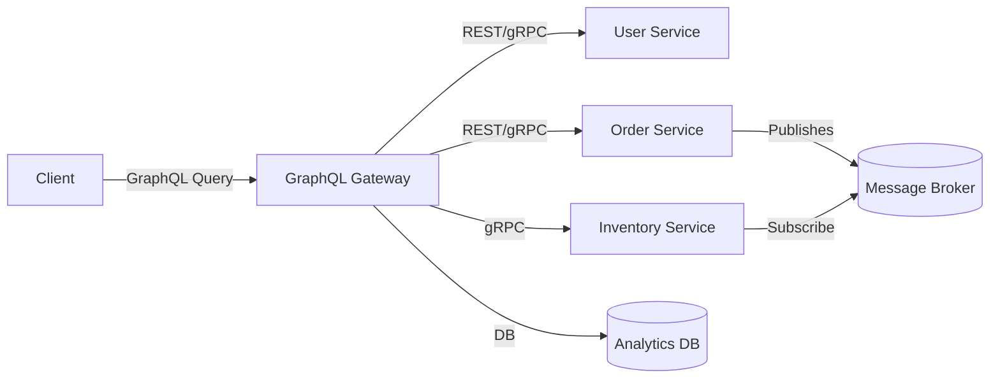

# aji-245410059-UTS-STDT
UTS Sistem Terdistribusi dan Terdesentralisasi

NAMA : Septian Aji Saputra
NIM : 245410059
Prodi : Informatika / IF-2
Jenjang : S1

Date : 17/11/2025

1. Jelaskan teorema CAP dan BASE dan keterkaitan keduanya. Jelaskan menggunakan contoh yang pernah anda gunakan.

Teorema CAP 
Dalam sistem terdistribusi yang mengalami network partition (P), Anda hanya busa memilih antara Consistency (C) atau Availability (A) -- tidak keduanya penuh. Artinya, saat terjadi pemisahan jaringan antar node, sistem harus memilih berikan data yang konsisten (menolak bebreapa permintaan) atau tetap tersedia (mengizinkan operasi lokal meski data mungkin tidak sepenuhnya konsisten).
 * Consistency (C) : semua klien melihat data yang sama (setelah operasi selesai)
 * Availability (A) : Setiap permintaan klien mendapat tespons (tidak menolak/timeout)
 * Partition Tolerance (P) : Sistem tetap berfungsi walau ada pemisahan jaringan antara node.

BASE (Basically Available, Soft state, Eventual consistency)
BASE adalah filosofi desain pada banyak sistem NoSQL (yang memilih Availability + Partition Tolerance). Komponen utamanya:
 * Basically Available --> sistem menjamin beberapa respons walau mungkin terbatas.
 * Soft state --> status/replica mungkin berubah selama waktu (tidak harus konsisten tiap saat).
 * Eventual consistency --> bila tidak ada update baru, akhirnya semua replica akan konsisten.
BASE sering dipakai ketika toleransi keterlambatan sinkronisasi diterima demi layanan tetap berjalan.

Keterkaitan CAP dan BASE
 * CAP adalah teorema/constraint (di level teori -- apa yang terjadi saat ada partisi).
 * BASE adalah strategi/pendekatan praktis untuk menghadapi trade-off CAP (ketika memilih A + P, menerima konsistensi secara eventual daripada strong/strict).
Jadi: jika sebuah sistem memilih Availability + Partition tolerance (A + P), biasanya desainnya mengarah ke pola BASE(eventual consistency). jika memilih Consistency + Partition tolerance (C + P), sistem sering menolak/menunda layanan

Contoh pada e-commerce -- Shopping Cart
 * Sistem cart yang mengutamakan Consistency (C):
    * Setiap update cart harus tersinkron ke semua node sebelum konfirmasi --> saat terjadi            partition, sistem menolak/tidak menerima perubahan supaya semua reader melihat total yang        sama (konsisten). Ini aman tapi dapat menolak pengguna.
 * Sistem cart yang mengutamakan Availability (A) + Partition Tolerance (P) --> menggunakan BASE:
    * Saat user update cart pada node A selama partisi, perubahan diterima lokal (respons              cepat). Setelah partition hilang, sistem melakukan reconcilation/merge (eventual                 consistency).
    * Contoh implementasi: microservice dengan DB NoSQL (Cassandra / Dynamo-style) yang menerima       penulisan lokal dan melakukan anti-entropy / hinted handoff / merge.

2. Jelaskan keterkaitan antara GraphQL dengan komunikasi antar proses pada sistem terdistribusi. Buat diagramnya. 

Konsep
 * GraphQL adalah bahasa query API yang memungkinkan klien meminta tepat data yang dibutuhkan       dalam satu permintaan. Dalam arsitektur terdistribusi, GraphQL sering berperan sebagai layer     agregasi/koordinator (Gateway) yang menerima permintaan dari klien lalu mengorkestrasi           pemanggilan ke beberapa layanan mikro (microservices) yang berbeda.
 * Komunikasi antar proses (IPC) di sini meliputi komunikasi antara:
    * GraphQL gatewar <--> microservices
    * microservices <--> database / message bus
    * GraphQL <--> federated GraphQL services (GraphQL federation)
GraphQL tidak menggantikan protokol IPC (seperti HTTP/gRPC/AMQP)--melainkan mengabstraksi dan mengorkestrasikan beberapa panggilan IPC agar klien cukup melakukan satu panggilan tunggal.

Pola arsitektur (penjelasan singkat)
 * Gateway GraphQL menerima query klien --> memanggil bebrapa layanan (HTTP/REST, gRPC, DB, atau    message broker) --> mengembalikan response tunggal ke klien.
 * Ini mengurangi round-trip dan memberi bentuk data konsisten di client.

Diagram

Penjelasan diagram:
 * Klien mengirim satu GraphQL query untuk user + recentOrders + orderItemsAvailability.
 * Gateway menerjemahkan: panggil UserService (HTTP), OrderService (gRPC), lalu InventoryService (gRPC) -- mungkin paralel.
 * Gateway merangkai hasil menjadi struktur JSON sesuai permintaan.
 * Di belakang layar, layanan juga saling berkomunikasi via IPC (REST/gRPC) atau lewat broker (EventBus) untuk sinkronisasi.

3. Dengan menggunakan Docker / Docker Compose, buatlah streaming replication di PostgreSQL yang bisa menjelaskan sinkronisasi. Tulislah langkah-langkah pengerjaannya dan buat penjelasan secukupnya.
PENJELASAN DOCKER-COMPOSE – STREAMING REPLICATION POSTGRESQL

File docker-compose.yml ini membangun dua service PostgreSQL:

postgres_primary → server utama (primary)

postgres_replica → server replika (standby)

Tujuannya adalah membuat Streaming Replication di PostgreSQL secara otomatis menggunakan pg_basebackup untuk sinkronisasi data.

1 Bagian: x-postgres-common
x-postgres-common:
  &postgres-common
  image: postgres:18-alpine
  user: postgres
  restart: always
  healthcheck:
    test: 'pg_isready -U zuser --dbname=zdb'
    interval: 10s
    timeout: 5s
    retries: 5

Fungsi:
&postgres-common adalah YAML anchor, berisi konfigurasi dasar yang dipakai oleh primary dan replica.
Menggunakan image postgres:18-alpine → lebih ringan
healthcheck: cek apakah database sudah siap menggunakan pg_isready.

2 Service: postgres_primary (Server Utama)
postgres_primary:
  <<: *postgres-common
Mengambil konfigurasi dari anchor sebelumnya.

Environment
environment:
  POSTGRES_USER: zuser
  POSTGRES_DB: zdb
  POSTGRES_PASSWORD: zpass
  POSTGRES_HOST_AUTH_METHOD: "scram-sha-256\nhost replication replicator 0.0.0.0/0 md5"
  POSTGRES_INITDB_ARGS: "--auth-host=scram-sha-256"
Penjelasan:
Membuat user utama: zuser
Database utama: zdb
Password: zpass
scram-sha-256 → metode autentikasi aman
Baris "host replication replicator 0.0.0.0/0 md5" mengizinkan user replicator melakukan streaming replication.

Command konfigurasi PostgreSQL
command: |
  postgres 
  -c wal_level=replica 
  -c hot_standby=on 
  -c max_wal_senders=10 
  -c max_replication_slots=10 
  -c hot_standby_feedback=on
| Parameter                  | Fungsi                                          |
| -------------------------- | ----------------------------------------------- |
| `wal_level=replica`        | Mengaktifkan WAL untuk keperluan replication    |
| `hot_standby=on`           | Mengizinkan replica melakukan query (read-only) |
| `max_wal_senders=10`       | Maksimal proses pengirim WAL                    |
| `max_replication_slots=10` | Mengaktifkan banyak replika                     |
| `hot_standby_feedback=on`  | Hindari konflik vacuum                          |

Init SQL
volumes:
  - ./00_init.sql:/docker-entrypoint-initdb.d/00_init.sql
File ini berisi perintah untuk:
Membuat user replika
Membuat replication slot

3 Service: postgres_replica (Server Replika)
postgres_replica:
  <<: *postgres-common
Menggunakan konfigurasi dasar yang sama.

Environment:
PGUSER: replicator
PGPASSWORD: replicator_password
PGDATA: /var/lib/postgresql/18/docker
Fungsi:
Mengatur user dan password yang dipakai untuk mengambil base backup.
Menentukan direktori penyimpanan data replika.

4 AUTOMATIC BASE BACKUP (SINKRONISASI AWAL)
Bagian terpenting dari seluruh sistem:
command: |
  bash -c "
  until pg_basebackup --pgdata=/var/lib/postgresql/18/docker -R --slot=replication_slot --host=postgres_primary --port=5432 -X stream; do
    echo 'pg_basebackup failed. Retrying in 5 seconds ...'
    sleep 5
  done

  echo 'Backup done, starting replica...'
  chmod 0700 /var/lib/postgresql/18/docker

  postgres
  "
Penjelasan prosesnya:
Step 1 — pg_basebackup
pg_basebackup menyalin seluruh data dari server primary.
Opsi penting:
| Opsi                      | Fungsi                                                   |
| ------------------------- | -------------------------------------------------------- |
| `--pgdata=...`            | Penyimpanan data replika                                 |
| `-R`                      | Membuat `standby.signal` dan `primary_conninfo` otomatis |
| `--slot=replication_slot` | Menggunakan replication slot                             |
| `-X stream`               | Menerima WAL secara streaming (real time)                |
| `--host=postgres_primary` | Terhubung ke service primary                             |
| `--port=5432`             | Port primary                                             |
Loop until memastikan jika backup gagal, dia mencoba ulang.

Step 2 — Set permission
chmod 0700 /var/lib/postgresql/18/docker
Folder data PostgreSQL harus punya permission 0700.

Step 3 — Start PostgreSQL
postgres
Setelah backup selesai, replika menjalankan PostgreSQL dan langsung masuk mode standby.

5 File SQL (00_init.sql)
CREATE USER replicator WITH REPLICATION ENCRYPTED PASSWORD 'replicator_password';
SELECT pg_create_physical_replication_slot('replication_slot');
Fungsi:
Membuat user replika
Hak khusus: WITH REPLICATION
Membuat replication slot
Slot ini mencegah WAL dihapus sebelum replika menerimanya.

6 Shell Alias
Alias ini mempermudah menjalankan Docker:
alias dcu="sudo docker-compose up -d"
alias dcd="sudo docker-compose down"
alias dps="sudo docker ps"
alias der="sudo docker exec -it streaming-replication-postgres_replica-1 bash"
alias dep="sudo docker exec -it streaming-replication-postgres_primary-1 bash"
alias dlr="sudo docker logs streaming-replication-postgres_replica-1"
alias dlp="sudo docker logs streaming-replication-postgres_primary-1"
Fungsi masing-masing:
| Alias | Fungsi                               |
| ----- | ------------------------------------ |
| `dcu` | Menjalankan seluruh service          |
| `dcd` | Menghentikan dan menghapus container |
| `dps` | Melihat container aktif              |
| `der` | Masuk ke container replika           |
| `dep` | Masuk ke container primary           |
| `dlr` | Melihat log replika                  |
| `dlp` | Melihat log primary                  |

